## 0x01 VPS 初始化
```
# passwd
# sed -i '2c HOSTNAME=WebSrv' /etc/sysconfig/network
# echo "127.0.0.1  WebSrv" >> /etc/hosts
# shutdown -r now
```

## 0x02 添加解析记录
```
去域名(建议用全新域名)下随便添加一条A记录(比如,sp),指向VPS ip即可
```
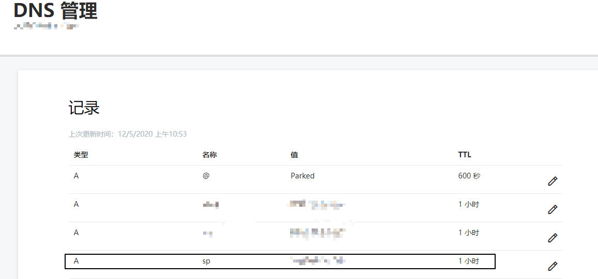

## 0x03 最终部署环境
```
各种钓鱼页需要自己事先准备打包压缩好[7z格式],并放至远程web目录下
脚本故意每一步都加了延迟,主要方便后续快速排查问题,最终会部署的环境,如下

Python-2.7.11 + Nginx-1.12.1 + Mysql-5.5.61 + PHP-5.5.38 + Certbot
```

## 0x04 实际效果
### 部署过程
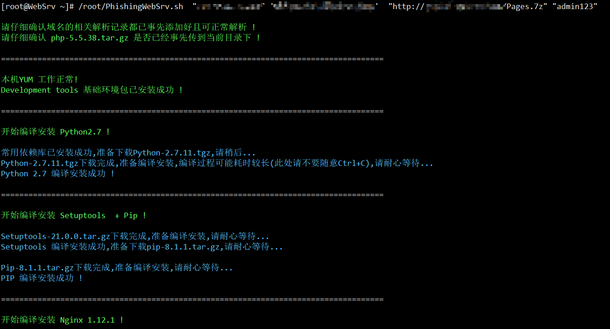
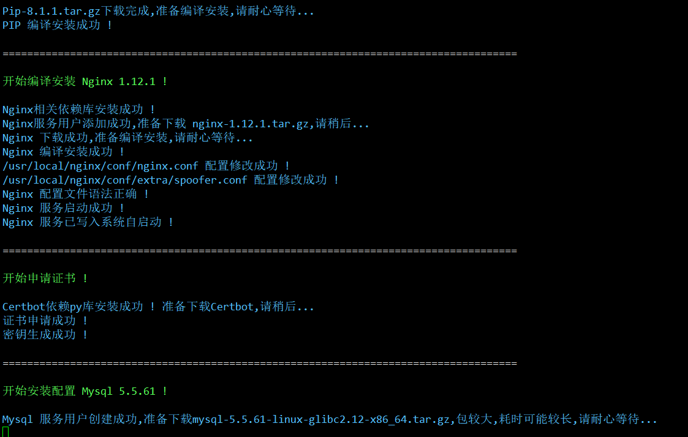
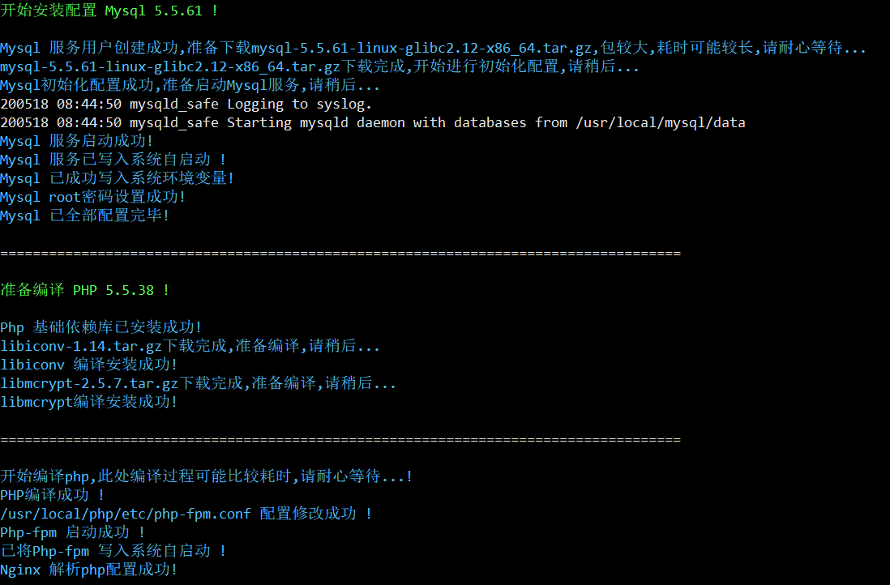
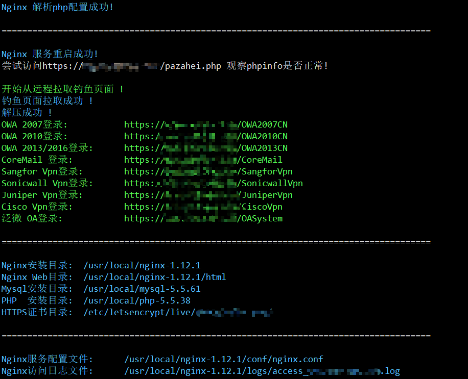
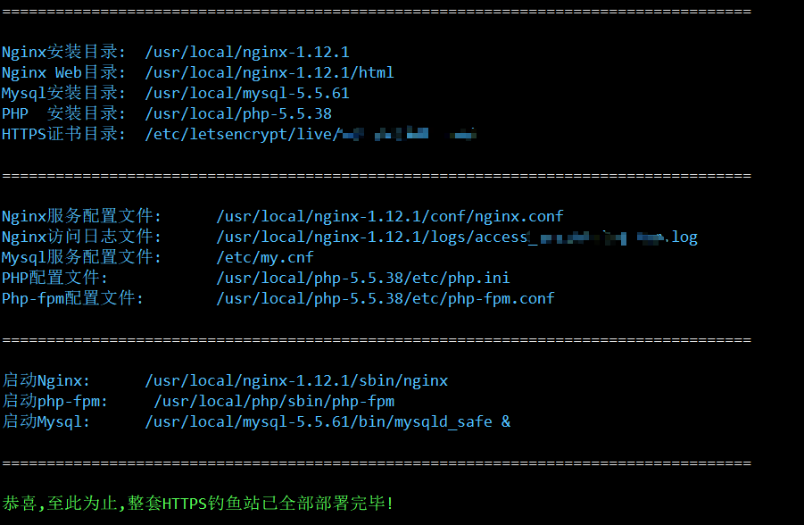
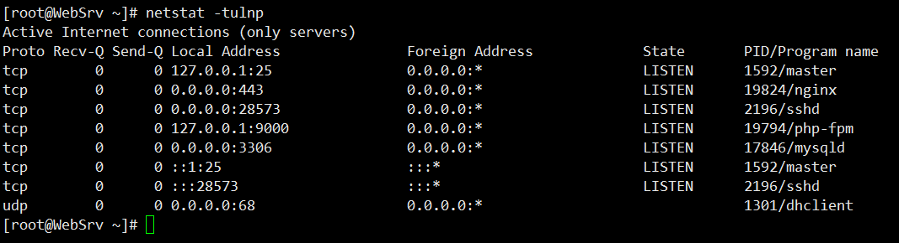

### 钓鱼页面
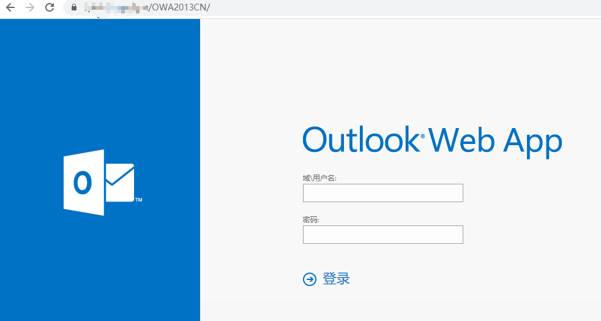
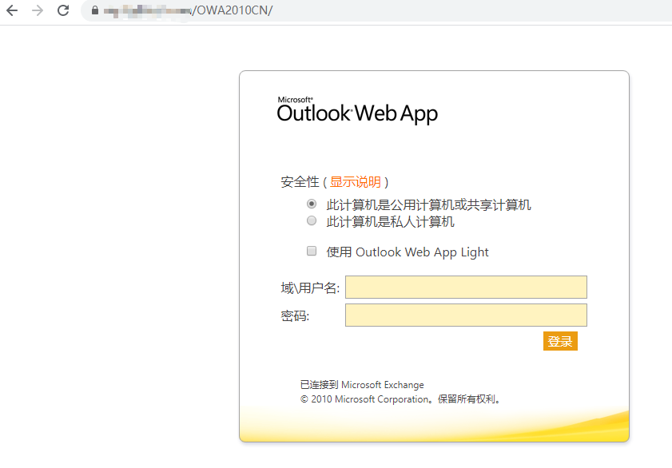
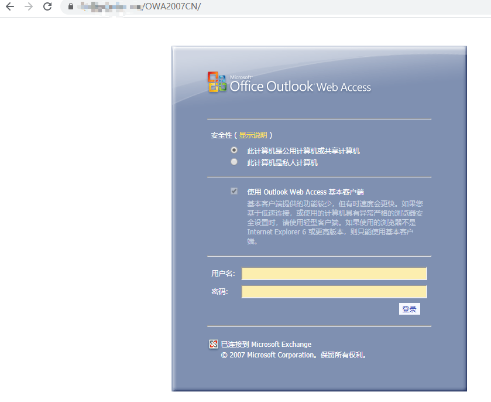
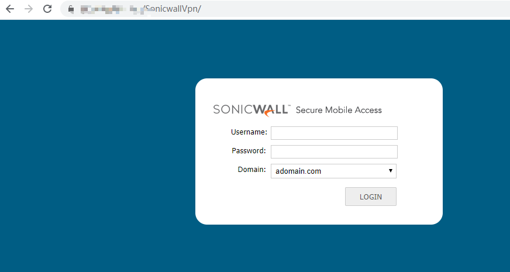
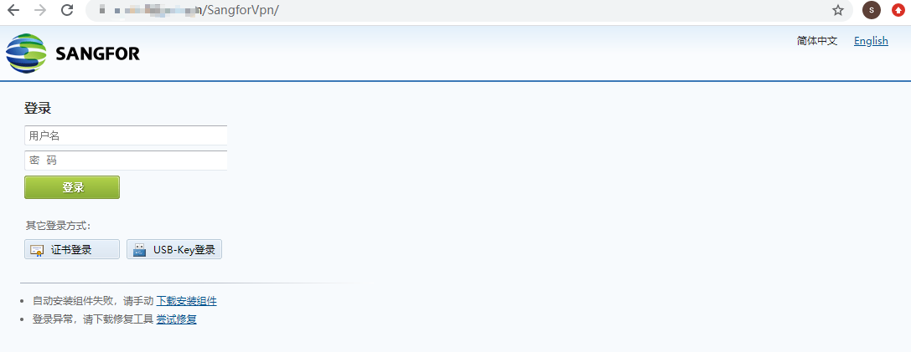
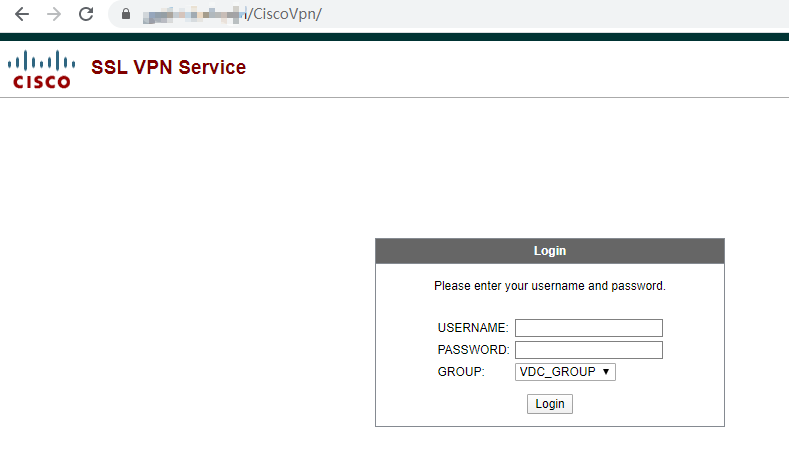


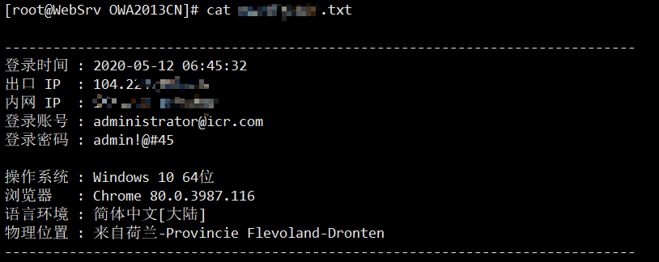

